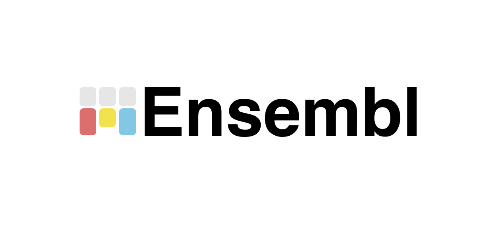
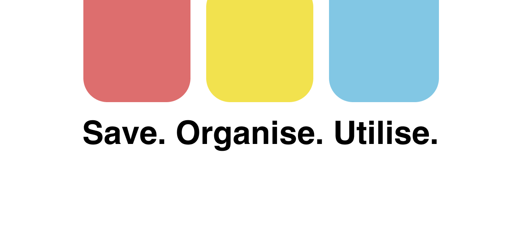

# 👋🏼 Welcome!!

Store all your saved and shared content from all your socials in one place. Recipes, date night ideas, and travel plans no longer come from Google searches; they come from TikToks, Instagram posts, YouTube Shorts, and other socials.

The problem is, there is no way to centrally manage the content you save and share across these platforms. You may have recipes saved on Instagram, TikTok, and shared from Facebook, and when you're looking for a specific recipe, you can't remember which platform you saved it on.

Ensembl resolves this problem by automatically storing your saved content as you use your socials and capturing your shared content. It organises and makes your content searchable. Now, when you need to find that chicken wrap recipe, you can easily locate it across all your platforms in seconds.

